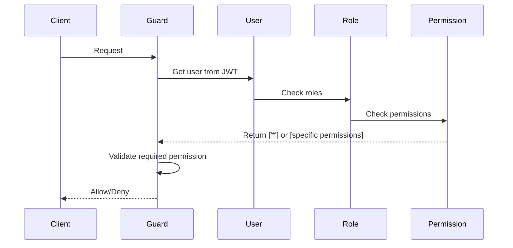

# Explicación de Roles, Permisos y Superadmin

## Estructura Actual

### 1. Autenticación por Email

**Sí, la estructura actual ya soporta autenticación por correo electrónico.**

La autenticación se realiza mediante:

- **Person** → Campo `email` (único)
- **User** → Vinculado a un **Actor** → Vinculado a una **Person**
- El login busca al usuario por el email de la Person

```typescript
// En auth.service.ts
async validateUser(email: string, password: string) {
    const user = await this.userRepository
        .createQueryBuilder('user')
        .leftJoinAndSelect('user.actor', 'actor')
        .leftJoinAndSelect('actor.person', 'person')
        .where('person.email = :email', { email })
        .andWhere('user.isActive = :isActive', { isActive: true })
        .getOne();
}
```

**Es opcional en desarrollo**: Puedes agregar más usuarios con sus emails correspondientes.

---

## 2. Diferenciación Superadmin

### Opción 1: Por ID (Primer Usuario)

La forma más simple es verificar si el `User.id === 1`:

```typescript
// En guards o services
if (user.id === 1) {
  // Es el superadmin original con permisos totales
  return true;
}
```

### Opción 2: Por Rol (Recomendado)

Usar el rol `SUPERADMIN` que tiene el permiso especial `['*']`:

```typescript
// En permissions.guard.ts
private extractPermissions(user: any): string[] {
    const permissions: string[] = [];

    // Verificar si tiene rol SUPERADMIN
    if (user.roles?.some(ur => ur.role?.code === 'SUPERADMIN')) {
        return ['*']; // Todos los permisos
    }

    // Para otros roles, extraer permisos normalmente
    // ...

    return permissions;
}
```

### Opción 3: Verificar Permiso `*`

El rol SUPERADMIN tiene `permissions: ['*']` que significa "acceso total":

```typescript
// Cuando se verifica un permiso
async canActivate(context: ExecutionContext): Promise<boolean> {
    const requiredPermissions = this.reflector.getAllAndOverride<string[]>(
        PERMISSIONS_KEY,
        [context.getHandler(), context.getClass()],
    );

    if (!requiredPermissions) {
        return true;
    }

    const { user } = context.switchToHttp().getRequest();
    const userPermissions = this.extractPermissions(user);

    // Si tiene permiso *, permitir todo
    if (userPermissions.includes('*')) {
        return true;
   实现的

    return requiredPermissions.some((permission) =>
        userPermissions.includes(permission),
    );
}
```

---

## 3. ¿Cómo Funciona el Permiso `*`?

El permiso `*` es un **wildcard** que significa "todos los permisos". Funciona así:

1. **Al crear el rol SUPERADMIN**: Se le asigna `permissions: ['*']`
2. **Al verificar permisos**: Si el usuario tiene permiso `*`, se le permite todo
3. **Independiente de nuevos permisos**: No importa cuántos permisos nuevos agregues, el `*` cubre todos

### Ejemplo:

```typescript
// Permisos del rol SUPERADMIN
{ roleCode: 'SUPERADMIN', permissions: ['*'] }

// Cuando se verifica si puede "users:delete"
if (userPermissions.includes('*') || userPermissions.includes('users:delete')) {
    return true; // ✅ Permitido
}
```

---

## 4. Usuarios Creados en el Seeder

El seeder crea **4 usuarios** con sus respectivos roles:

| Email                    | Password      | Rol           | Descripción                        |
| ------------------------ | ------------- | ------------- | ---------------------------------- |
| superadmin@hemmy.com     | superadmin123 | SUPERADMIN    | Acceso total al sistema            |
| administradora@hemmy.com | admin123      | ADMINISTRADOR | Administrador con permisos amplios |
| tecnico@hemmy.com        | tecnico123    | TECNICO       | Técnico de campo                   |
| secretaria@hemmy.com     | secretaria123 | SECRETARIA    | Secretaria administrativa          |

---

## 5. Estructura de Relaciones

```
User (passwordHash, isActive)
  ↓ ManyToOne
Actor (displayName, kind)
  ↓ OneToOne
Person (firstName, lastName, email)

User ← UserRole → Role ← RolePermission → Permission
```

---

## 6. Flujo de Verificación de Permisos



---

## 7. Implementación Práctica

### En el Guard:

```typescript
private extractPermissions(user: any): string[] {
    const permissions: string[] = [];

    // 1. Verificar si es SUPERADMIN (permiso *)
    if (user.roles?.some(ur => ur.role?.code === 'SUPERADMIN')) {
        return ['*'];
    }

    // 2. Extraer permisos de roles
    user.roles?.forEach(userRole => {
 indicatorsroleRole?.rolePermissions?.forEach(rp => {
            const permCode = rp.permission?.code;
            if (permCode && instrucciones.includes(permCode)) {
                permissions.push(permCode);
            }
        });
    });

    // 3. Extraer permisos directos del usuario
    user.userPermissions?.forEach(up => {
        if (up.mode === 'GRANT') {
            permissions.push(up.permission.code);
        }
    });

    return permissions;
}
```

### En el Controller:

```typescript
@UseGuards(JwtAuthGuard, PermissionsGuard)
@Permissions('users:delete')
@Delete(':id')
async deleteUser(@Param('id') id: number) {
    // Solo usuarios con permiso 'users:delete' o '*'
    return this.userService.delete(id);
}
```

---

## Conclusión

- ✅ **Autenticación por email**: Ya implementada, solo necesitas crear personas con emails
- ✅ **Superadmin con acceso total**: Usar rol SUPERADMIN con permiso `['*']`
- ✅ **Permiso `*` cubre todo**: No importa cuántos permisos nuevos agregues
- ✅ **4 usuarios creados**: Con sus respectivos roles y permisos

La estructura es escalable y el superadmin siempre tendrá acceso total con el permiso `*`.
